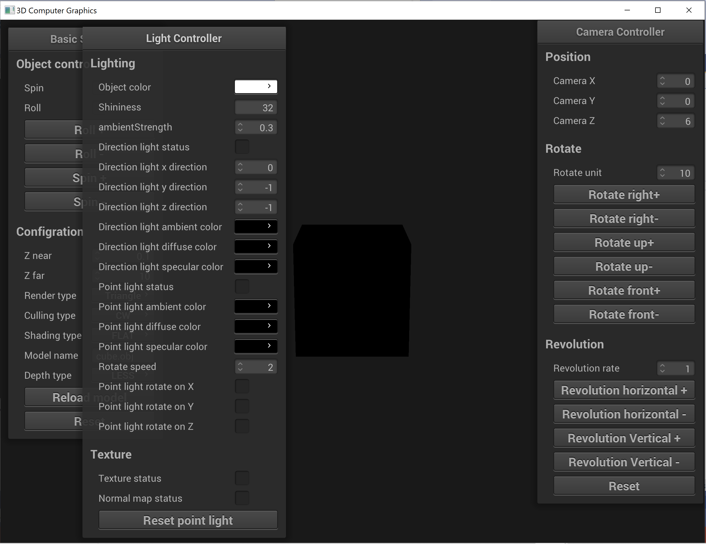
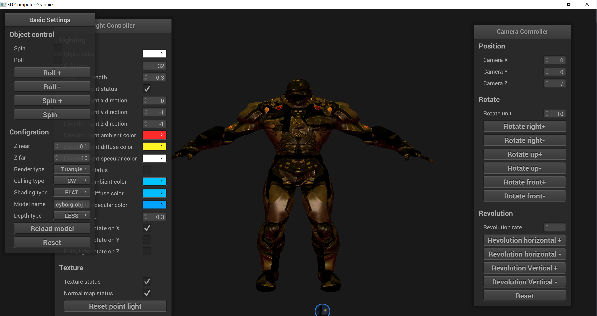
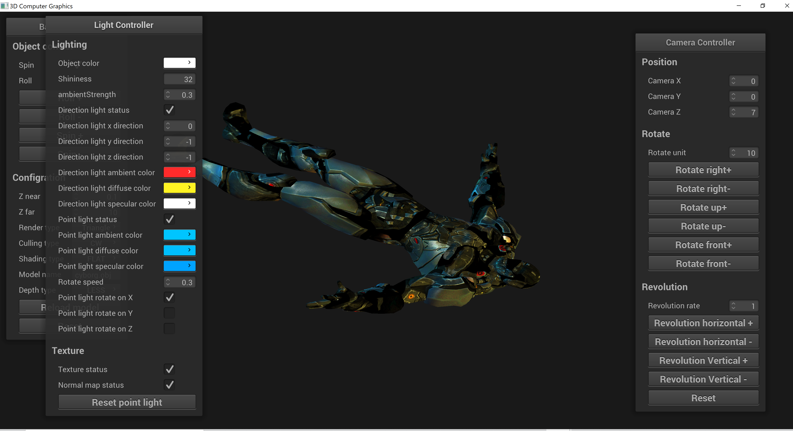
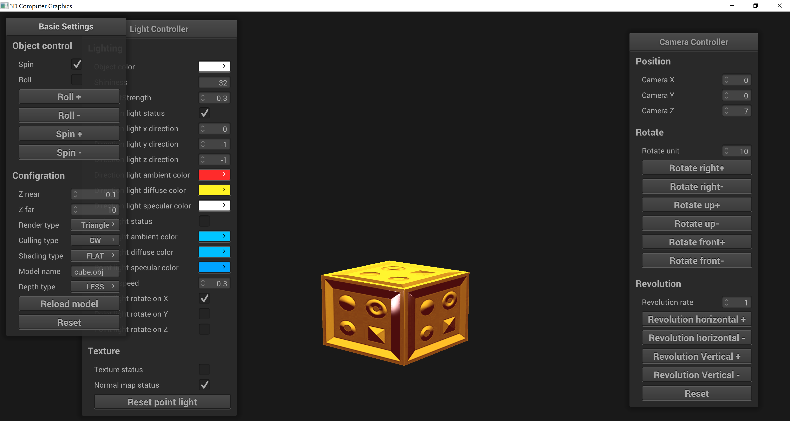
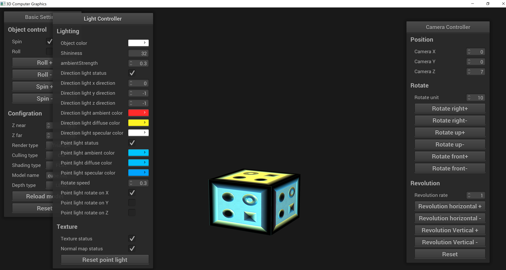
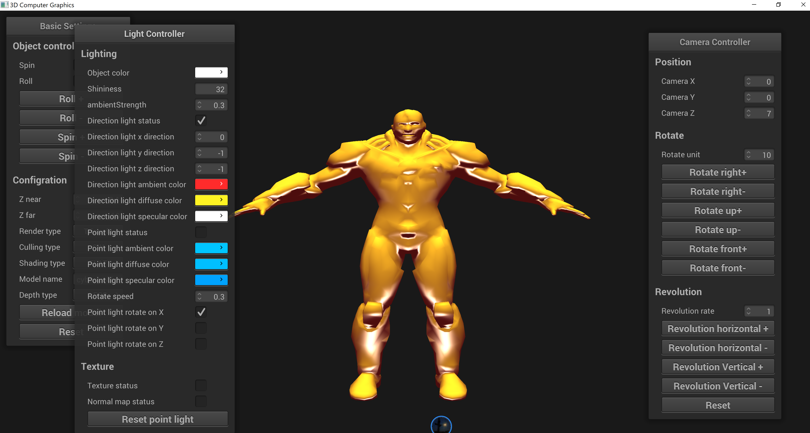
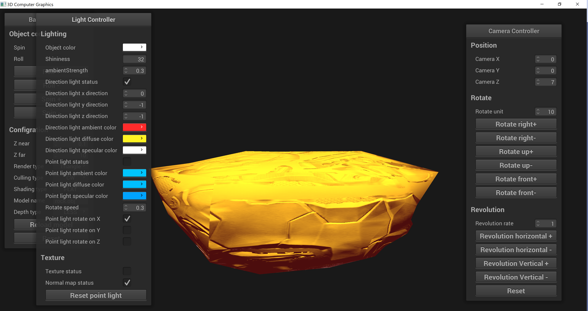
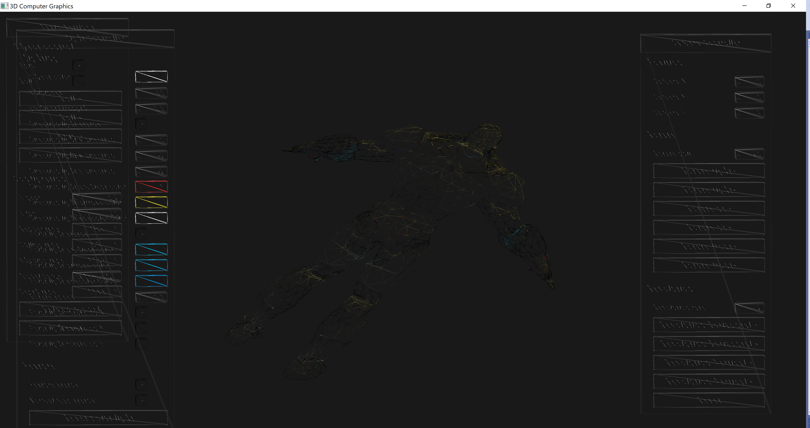
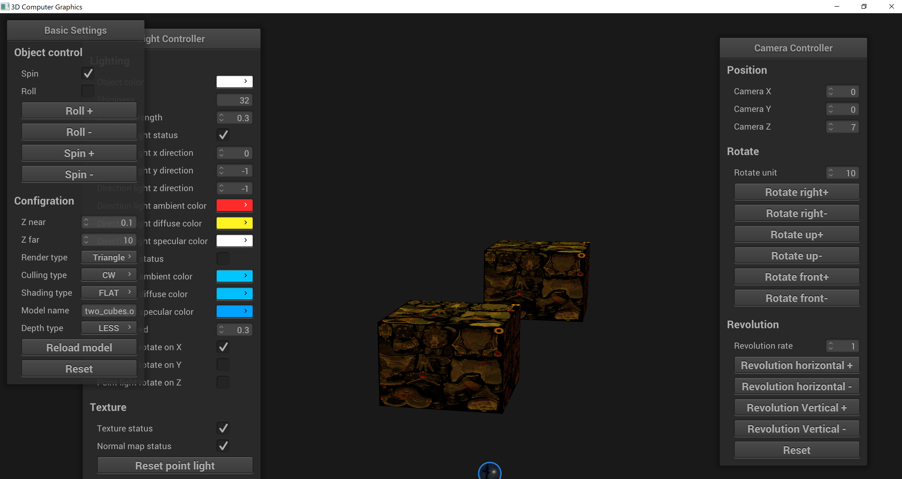

# 3D_Computer_Graphics_2
3D_models, Camera and lights

# This project includes 6 files of codes
1. Assignment2.cpp
2. Camera.cpp
3. DirectionLigit.cpp
4. PointLight.cpp
5. shader/basic.frag
6. shader/basic.vert
  <b>You can paste these code in Visual Studio for setting up.</b>

# Environment configuration are detailed in Instruction.pdf
* All configuration files parts can be found in OpenGL_configuration file

# Some screen shots
* 
* 
* 
* 
* 
* 
* 
* 
* 
